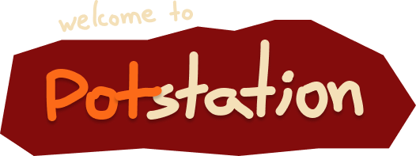

- [Introduction](#introduction)
- [Features](#features)
- [Next steps](#next-steps)
- [Aknowledgements](#aknowledgements)

## Introduction

- ### Create amazing vessels like an artisan

Potstation is an app to play with by creating and customizing vessels and pots inspired by the beautiful handmade work of potters and artisans. With Potstation, the users are able to draw the pot's profile and see the result of its revolution either on a 3D virtual space or on their room!

- ### Swift Student Challenge

This project was made as a Swift Playgrounds App for [Swift Student Challenge 2022](https://developer.apple.com/wwdc22/swift-student-challenge/) to run on iPad.

## Features

- ### Draw your pot

In Potstation you create a pot by drawing its profile into the canvas. The path that you have drawn is revolved around the left axis of the canvas to form the 3D geometry that you expect.

- ### Customize

The customization enable that you paint your pot with different colors and also enhance it with an art from Potstation collection.

- ### See the result

It's just time to draw your pot and the 3D model is already being displayed on screen in a virtual space that you can control. Furthermore, you are able to visualize it in your room with Augmented Reality technology. You just need to localize a surface, place your vase on it and see how it looks.

## Next steps

My main goal with Potstation is to publish it on AppStore. Before this, I want to add the feature of taking a vase's picture in AR world and maybe improve the code to optimize the process of modeling the 3D pot.

## Aknowledgements

This app wouldn't be possible without the work of [Nick Lockwood](https://github.com/nicklockwood) on [Euclid](https://github.com/nicklockwood/Euclid) library. Potstation uses it to create the pot's geometry by revolution.

I also might thanks [Maher Bhavsar](https://medium.com/@maherbhavsar) for the good series of articles about ARKit which I read to learn how to implement it in my app.

Finally, I want to thanks my peers from Apple Developer Academy - Campinas, Brazil for helping on testing and advices.